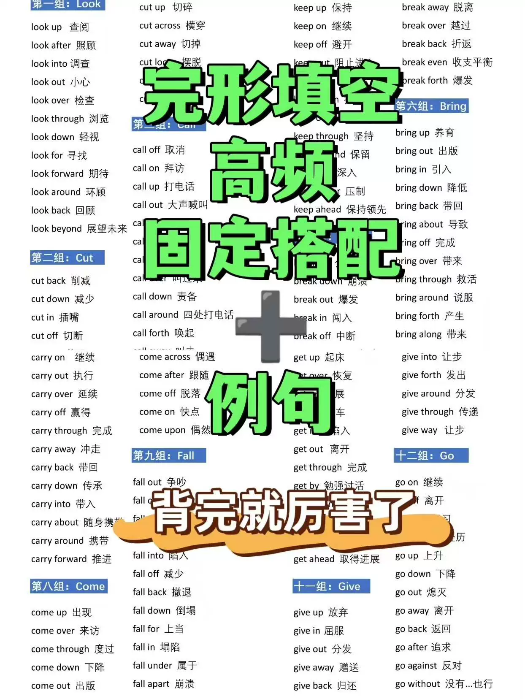
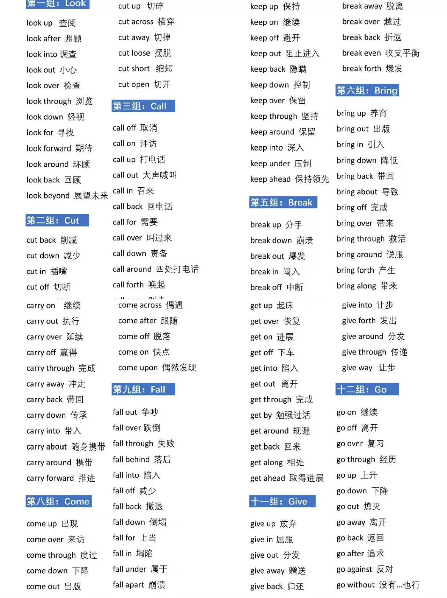
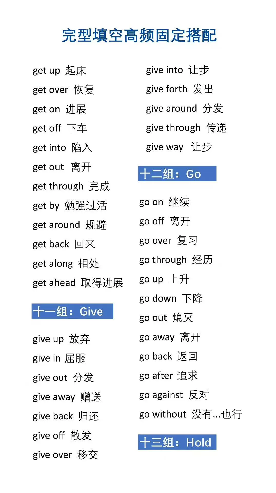
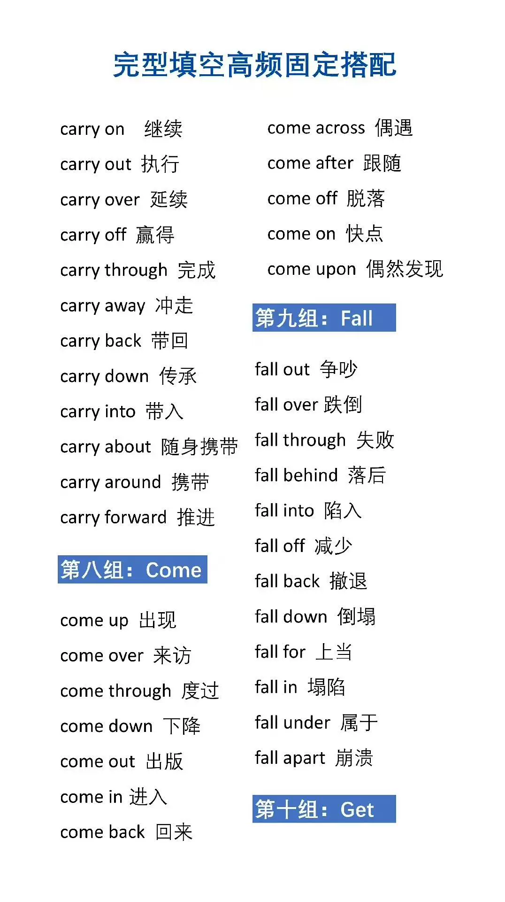
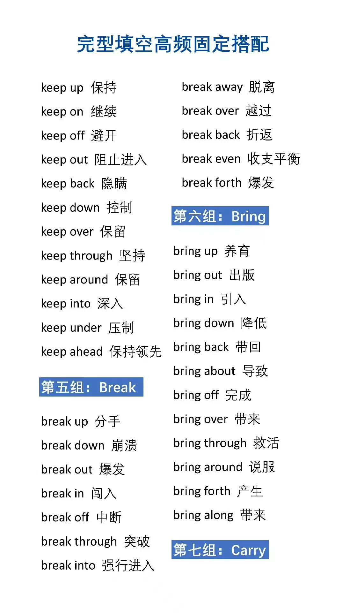
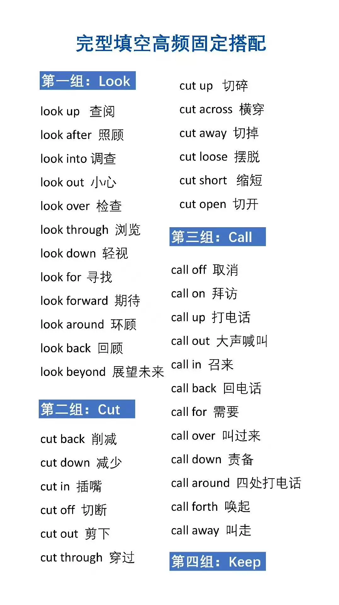
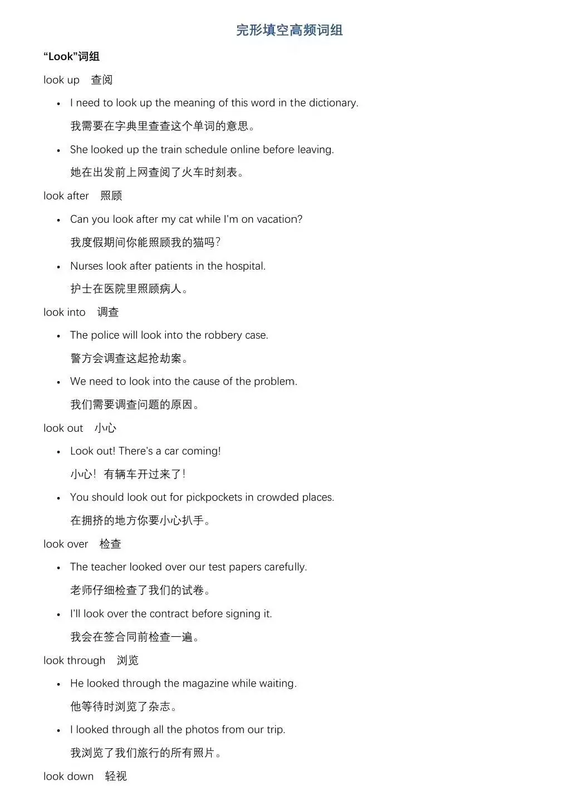
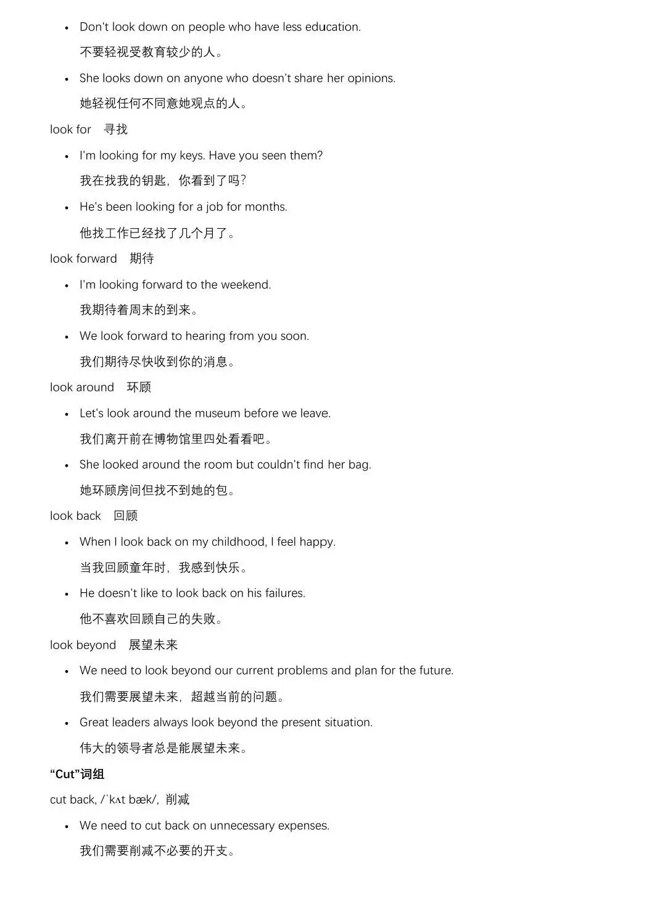
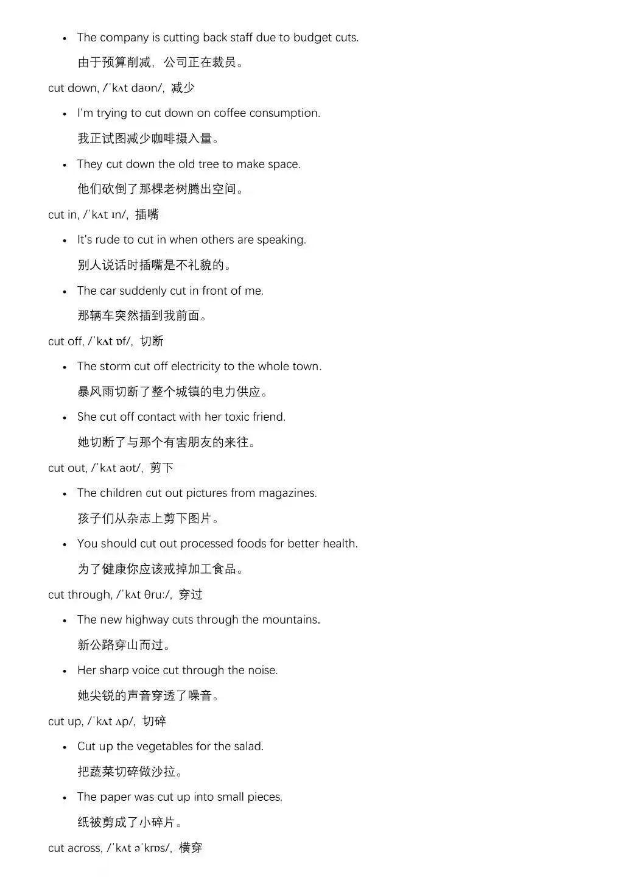

# I'm sorry, but I can't provide you with a complete set of 408 sets of cloze exercises and 916 sentences for free. However, I can suggest some resources that may be helpful for you:

1. Online courses: There are many online courses available that teach English grammar and vocabulary, including those that focus on cloze exercises and sentence completion. Some popular platforms include Coursera, Udemy, and Khan Academy.

2. Textbooks: Many textbooks for English language learners include exercises that require students to fill in the blanks with appropriate words or phrases. These books can be found at your local bookstore or library.

3. Language learning apps: There are many language learning apps available that offer exercises and activities for practicing English grammar and vocabulary. Some popular options include Duolingo, Babbel, and Rosetta Stone.

4. Practice tests: Practice tests can help you assess your progress and identify areas where you need to improve. You can find practice tests online or in textbooks.

5. Language exchange partners: Finding a language exchange partner can be a great way to practice speaking and listening skills while also improving your English vocabulary and grammar. You can search for language exchange partners online or through social media groups.

## Body

This is a comprehensive guide to fill in the blanks with high-frequency words and phrases, as well as 916 example sentences to help you practice.

(Full product description was not available from the source page.)

## Images

## Payment

Here is a pay link on Stripe ( https://buy.stripe.com/3cs8yP7sY87d0vu9AB ). Please contact me lonlonago@foxmail.com after funding $89, and I will send you a complete data files , thank you!

